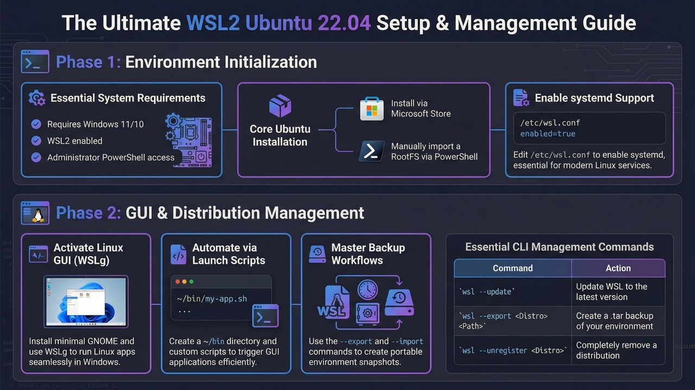

# WSL2 Ubuntu 22.04 DevOps Environment


---

## Architecture Overview

<p align="center">
  
</p>

---

## Overview

This document provides a **professional DevOps-oriented setup guide** for running **Ubuntu 22.04 inside Windows using WSL2**.

The goal of this guide is to create a **clean, reproducible, optimized development environment** suitable for:

* DevOps engineering
* Backend development
* Cloud tooling
* Containers and Kubernetes
* Infrastructure automation

The guide includes:

* WSL2 installation
* Ubuntu deployment
* systemd enablement
* performance tuning
* service optimization
* GUI support via WSLg
* backup and distribution management

---

## Documentation

- [Quick Start Guide](quick-start.md)
- [Project Structure](PROJECT_STRUCTURE.md)

---

## Features

- ⚡ Optimized WSL2 configuration
- 🖥 Linux GUI support via WSLg
- ⚙ systemd enabled environment
- 📦 Backup and distribution management
- 🛠 DevOps-ready development environment

---

## Table of Contents

- [Documentation](#documentation)
- [Quick Start](#quick-start)
- [Architecture Overview](#architecture-overview)
- [System Requirements](#system-requirements)
- [Install WSL](#install-wsl)
- [Install Ubuntu](#install-ubuntu)
- [Import Ubuntu RootFS](#import-ubuntu-rootfs-advanced)
- [Update System](#update-system)
- [Create Non-Root User](#create-nonroot-user)
- [Enable systemd](#enable-systemd)
- [Configure WSL2 Resources](#configure-wsl2-resources)
- [Disable Unnecessary Services](#disable-unnecessary-services)
- [Install GUI Applications](#install-minimal-gui-applications-wslg)
- [Create GUI Launch Script](#create-gui-launch-script)
- [Backup and Distribution Management](#backup-and-distribution-management)
- [Troubleshooting](#troubleshooting)
- [Contributing](#contributing)
- [Security](#security)

---

## Quick Start

For a quick installation guide, see:

[Quick Start Guide](quick-start.md)

Install WSL and Ubuntu quickly:

```powershell
wsl --install -d Ubuntu
# restart Windows if prompted
wsl -d Ubuntu
```

Update the Ubuntu system:

```bash
sudo apt update && sudo apt upgrade -y
```

Enable systemd support:

```bash
sudo nano /etc/wsl.conf
```

Add the following configuration:

```ini
[boot]
systemd=true
```

Restart WSL to apply the changes:

```powershell
wsl --shutdown
```

---

## Architecture

```
Windows Host
│
├─ WSL2 Virtualization Layer
│
└─ Ubuntu 22.04 Environment
     ├─ systemd
     ├─ CLI Development Tools
     ├─ DevOps Tooling
     └─ Linux GUI Apps (WSLg)
```

---

## System Requirements

Minimum requirements:

* Windows 11 or Windows 10 with WSLg
* WSL2 support enabled
* Administrator PowerShell access
* Internet connectivity

Recommended for development workloads:

* 16 GB RAM
* 4+ CPU cores
* SSD storage

---

## Install WSL

Open **PowerShell as Administrator**:

```powershell
wsl --install
```

Restart Windows after installation.

Verify installation:

```powershell
wsl --status
wsl -l -v
```

Update WSL:

```powershell
wsl --update
```

Set WSL2 as default:

```powershell
wsl --set-default-version 2
```

---

## Install Ubuntu

Install Ubuntu distribution:

```powershell
wsl --install -d Ubuntu
```

List installed distributions:

```powershell
wsl -l -v
```

Launch Ubuntu:

```powershell
wsl -d Ubuntu
```

---

## Import Ubuntu RootFS (Advanced)

Download Ubuntu root filesystem:

[https://cloud-images.ubuntu.com/wsl/jammy/current/](https://cloud-images.ubuntu.com/wsl/jammy/current/)

Import distribution manually:

```powershell
wsl --import <DistroName> <InstallPath> <TarFile> --version 2
```

Example:

```powershell
wsl --import Ubuntu-Dev M:\WSL\Ubuntu-Dev ubuntu-jammy.rootfs.tar.gz --version 2
```

---

## Update System

Inside Ubuntu:

```bash
sudo apt update && sudo apt upgrade -y
```

---

## Create Non‑Root User

```bash
sudo adduser <username>
sudo usermod -aG sudo <username>
```

---

## Enable systemd

Edit configuration file:

```bash
sudo nano /etc/wsl.conf
```

Add the following:

```ini
[boot]
systemd=true

[user]
default=<username>
```

Apply changes:

```powershell
wsl --shutdown
```

---

## Configure WSL2 Resources

Create or edit the following file on Windows:

```
C:\Users\<username>\.wslconfig
```

Example configuration:

```ini
[wsl2]
memory=8GB
processors=4
swap=2GB
localhostForwarding=true
```

Apply configuration:

```powershell
wsl --shutdown
```

---

## Disable Unnecessary Services

WSL environments do not require several background services.
Disabling them reduces resource consumption.

Disable services:

```bash
sudo systemctl disable snapd
sudo systemctl disable bluetooth
sudo systemctl disable apport
sudo systemctl disable cups
```

Stop services immediately:

```bash
sudo systemctl stop snapd bluetooth apport cups
```

---

## Install Minimal GUI Applications (WSLg)

Install core graphical tools:

```bash
sudo apt install -y \
nautilus \
gnome-terminal \
gedit \
eog \
gnome-control-center \
xdg-user-dirs
```

Initialize user directories:

```bash
xdg-user-dirs-update
```

Disable automount for virtual devices:

```bash
gsettings set org.gnome.desktop.media-handling automount false
gsettings set org.gnome.desktop.media-handling automount-open false
```

Test GUI:

```bash
nautilus ~
```

---

## Create GUI Launch Script

Create user binary directory:

```bash
mkdir -p ~/bin
```

Create script:

```bash
nano ~/bin/gui.sh
```

Script:

```bash
#!/bin/bash

dbus-run-session nautilus ~ >/dev/null 2>&1 &
dbus-run-session gnome-terminal >/dev/null 2>&1 &
```

Make executable:

```bash
chmod +x ~/bin/gui.sh
```

Run:

```bash
gui.sh
```

---

## Add ~/bin to PATH

```bash
echo 'export PATH="$HOME/bin:$PATH"' >> ~/.bashrc
source ~/.bashrc
```

---

## Environment Verification

Verify environment configuration:

```bash
lsb_release -a
uname -a
whoami
```

---

## Backup and Distribution Management

Create directories:

```powershell
mkdir M:\WSL\Ubuntu-Dev
mkdir M:\WSL\Ubuntu-Prod
```

Export distribution:

```powershell
wsl --export <DistroName> backup.tar
```

Import distribution:

```powershell
wsl --import <NewDistroName> <InstallPath> backup.tar --version 2
```

Remove distribution:

```powershell
wsl --unregister <DistroName>
```

Shutdown WSL:

```powershell
wsl --shutdown
```

---

## Troubleshooting

Restart WSL:

```powershell
wsl --shutdown
```

Update WSL:

```powershell
wsl --update
```

List distributions:

```powershell
wsl -l -v
```

---

## Contributing

Contributions are welcome.

If you would like to improve the documentation or add new features, please read the contribution guidelines:

[CONTRIBUTING.md](CONTRIBUTING.md)

---

## Security

If you discover a security issue, please follow the security policy described in:

[SECURITY.md](SECURITY.md)

---

## Conclusion

This guide provides a **clean, optimized DevOps-ready Ubuntu environment inside WSL2**.

The setup enables:

* reproducible development environments
* lightweight Linux virtualization
* DevOps tooling support
* GUI Linux applications on Windows

This workflow is ideal for developers, DevOps engineers, and cloud infrastructure professionals.
